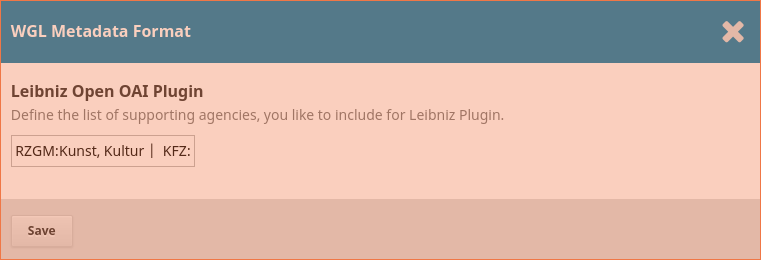

##  Leibniz-Open OAI Metadata Plugin for OJS 3.1.x and OMP 3.1.x

OAI plugin for [Open Journal Systems](https://github.com/pkp/ojs) and [Open Monograph Press](https://github.com/pkp/omp) 
which exposes metadata in the leibniz harvesting scheme. 

http://www.leibnizopen.de/fileadmin/default/documents/oai_wgl/oai_wgl.xsd

## About
This plugin exposes metadata in OJS/ OMP OAI interface in the Lebiniz-Open metadata format.


## License
This plugin is licensed under the GNU General Public License v3. 

## Compatibility
This plugin is compatible with OJS 3.1.x and OMP 3.1.x

## Installation

via git
 
```bash
cd $OJS_ROOT
cd plugins/oaiMetadataFormats/
git clone https://www.github.com/withanage/ojsLeibnizOpen wgl
git checkout your_branch 

```

via zip file (tar.gz)

  - Unpack the plugin tar.gz file to your plugins/oaiMetadataFormats directory
   (see [Releases](https://github.com/withanage/ojsLeibnizOpen/releases))
 
## Settings   
  - Navigate to Management > Website Settings > Plugins > OAI Metadata Format Plugins
  - Enable checkbox beside "WGL Metadata Format Plugin"
  - Click settings
  - Set the list of Leibniz-Institutes in following format.
   `Agency1:Agency1 Description | Agency2:Agency2 Description `
   
   - 
   
  - In your submissions catalog entry add the agency name  e.g. Agency1 
 
 ## Output example
 ```xml
 
<?xml version="1.0" encoding="UTF-8"?>
<?xml-stylesheet type="text/xsl" href="http://localhost:8002/lib/pkp/xml/oai2.xsl" ?>
<OAI-PMH xmlns="http://www.openarchives.org/OAI/2.0/"
	xmlns:xsi="http://www.w3.org/2001/XMLSchema-instance"
	xsi:schemaLocation="http://www.openarchives.org/OAI/2.0/
		http://www.openarchives.org/OAI/2.0/OAI-PMH.xsd">
	<responseDate>2019-02-20T08:44:07Z</responseDate>
	<request verb="ListRecords" metadataPrefix="oai_wgl">http://localhost:8002/index.php/omp3_1_1_4/oai</request>
	<ListRecords>
		<record>
			<header>
				<identifier>oai:omp.localhost:8003:publicationFormat/1</identifier>
				<datestamp>2019-02-19T14:04:01Z</datestamp>
				<setSpec>omp3_1_1_4</setSpec>
			</header>
			<metadata>
<?xml version="1.0"?>
<oai_wgl:wgl xmlns:oai_wgl="http://www.leibnizopen.de/fileadmin/default/documents/oai_wgl" xmlns:wgl="http://www.leibnizopen.de/fileadmin/default/documents/wgl_dc" xmlns:xsi="http://www.w3.org/2001/XMLSchema-instance" xsi:schemaLocation="http://www.openarchives.org/OAI/2.0/oai_dc/ http://www.openarchives.org/OAI/2.0/oai_dc.xsd">
  <wgl:title xml:lang="en-US">title</wgl:title>
  <wgl:creator>admin, admin</wgl:creator>
  <wgl:description xml:lang="en-US">abstract</wgl:description>
  <wgl:publisher xml:lang="en-US">omp_3_1_1_4</wgl:publisher>
  <wgl:date>2019-02-19</wgl:date>
  <wgl:type xml:lang="en-US">Book</wgl:type>
  <wgl:format>Digital (DA)
			</wgl:format>
  <wgl:identifier>http://localhost:8002/index.php/omp3_1_1_4/catalog/book/1</wgl:identifier>
  <wgl:source xml:lang="en-US">omp_3_1_1_4; </wgl:source>
  <wgl:wgltype>Monographie</wgl:wgltype>
  <wgl:wglcontributor>RZGM</wgl:wglcontributor>
  <wgl:wglsubject>Kunst, Kultur</wgl:wglsubject>
</oai_wgl:wgl>
			</metadata>
		</record>
	</ListRecords>
</OAI-PMH>

 ``` 

## Author

Dulip Withanage https://www.github.com/withanage


